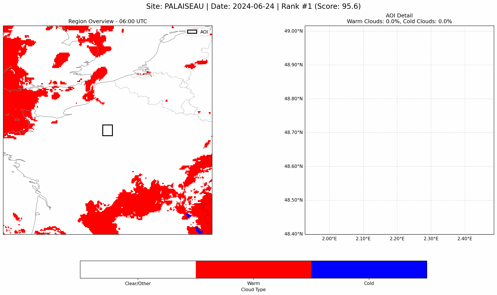
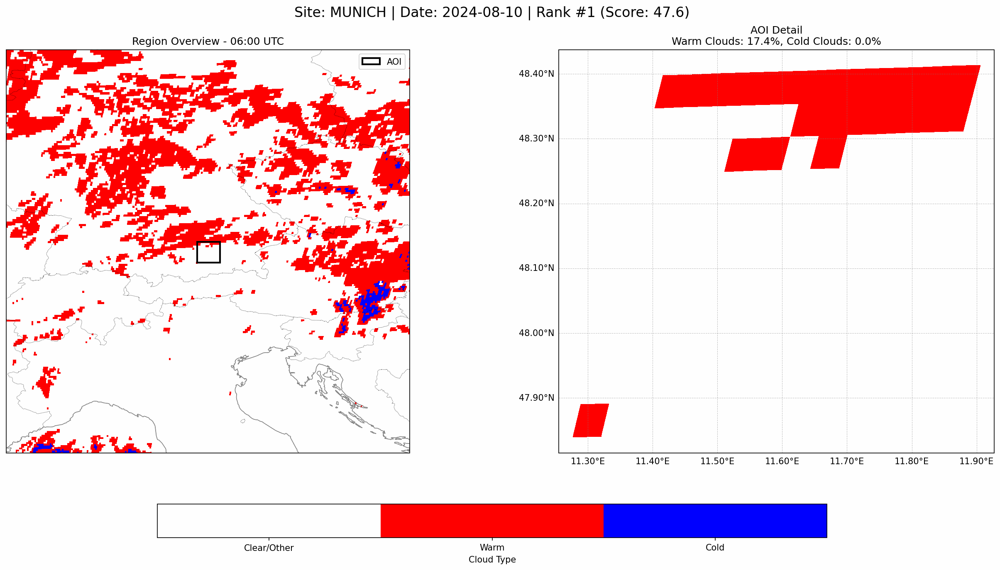

## METEOSAT-LES: Cloud Screening for Large Eddy Simulations

A pipeline to screen Meteosat NWCSAF Cloud Type data and identify days suitable for Large Eddy Simulations (LES). It ranks days per month and generates visual summaries for the best candidates.

### What this does
- **Ranks LES days** from NWCSAF Cloud Type for April–September 2024 (configurable)
- **Generates** rankings and GIFs/PNGs for the top days
- **Runs** across many CloudNet sites, one site or all sites

## Requirements
- Python 3.8+
- Install Python deps if needed:
```bash
pip install -r requirements.txt
```

## Main ways to run

### 1) All CloudNet sites (recommended)
```bash
./run_all_cloudnet_sites.sh
```
- Or make it executable first: `chmod +x run_all_cloudnet_sites.sh`
- This calls `run_multi_month_analysis.sh` for each site, one after the other.

### 2) Single site, all configured months
```bash
./run_multi_month_analysis.sh PALAISEAU
```
- Make it executable first if needed: `chmod +x run_multi_month_analysis.sh`
- Edit months in `run_multi_month_analysis.sh` → `MONTHS=("2024-04" ... "2024-09")`

### 3) One month directly via Python (advanced)
```bash
python les-screening-monthly.py \
  --month 2024-06 \
  --data-root /mnt/m0/y-m.saint-drenan/data/NWCSAF_CloudType/2024 \
  --out-root PALAISEAU/output_2024-06 \
  --lat 48.717 --lon 2.209 --site PALAISEAU
```

## Visualizations
- After an analysis run, create GIFs/PNGs of the top ranked days.

### Examples

Palaiseau — Rank #1 day (2024-06-24):



Munich — Rank #1 day (2024-08-10):



### Top days (automatic ranking file discovery)
```bash
SITE=PALAISEAU MONTH=2024-06 TOP_N=3 python generate_top_day_visualizations.py
```
- `SITE` is required. If `MONTH` is omitted, the latest `output_*` folder under `SITE/` is used.
- Output goes to `SITE/output_YYYY-MM/top_days_gif_SITE/` and `top_days_png_SITE/`.

### Single day (manual)
```bash
python generate_single_day_visualization.py \
  --date 2024-06-24 \
  --site PALAISEAU  # if the script supports site, otherwise set lat/lon if required
```

## Supported sites
- PALAISEAU, MUNICH, CABAUW, LINDENBERG
- BUCHAREST, CHILBOLTON, CLUJ, GALATI, GRANADA, HYYTIALA, JUELICH, KENTTAROVA,
  LAMPEDUSA, LEIPZIG, LEIPZIG-LIM, LIMASSOL, MACE-HEAD, MAIDO, MINDELO, NEUMAYER,
  NORUNDA, NY-ALESUND, PAYERNE, POTENZA, RZECIN, SCHNEEFERNERHAUS, WARSAW

## Output structure
For each site and month:
```
SITE/
  output_YYYY-MM/
    les_suitability_ranking_YYYY-MM_SITE.csv
    top_days_gif_SITE/*.gif
    top_days_png_SITE/*.png
```
Also created at repo root during runs:
- `multi_month_analysis_robust.log`
- `multi_month_progress.txt`

## Scoring (overview)
- Daytime considered: 06–18 UTC
- Final score combines two components: breakability (variability) and mean warm-cloud presence
- Weights: 0.75 breakability, 0.25 traditional (mean warm), but both are subject to penalties/bonuses below

### Penalties
- Low variability: progressively penalized when std(warm %) < 35, very strong penalty if < 15
- Extreme hourly swings: penalized when max hourly change > 15%, very strong if > 50% (prefers gradual evolution)
- Persistent clouds: std/mean ratio penalty; strong penalties for long sequences of 100% warm clouds (≥10, 12, 15 consecutive frames)
- Overcast duration: strong penalty if > 30–50% of daytime, very strong if > 50%
- Warm coverage outside sweet spot: penalize very high mean warm (> 80–90%), or very low (< 25%)
- Thin/high clouds: strong to extreme penalties as mean cold % increases; even minimal cold clouds reduce score
- Too much low coverage time: penalize if > 60% of the day is in 15–45% warm range (insufficient development)

### Bonuses
- Clear periods: bonus if > 10–20% of the day is clear (< 15% warm), indicating good breakability
- Moderate development time: bonus when 45–75% warm coverage occupies ~20–50% of day
- Good overall days: if mean warm > 60, std warm > 25, and mean cold < 5, reduce other penalties further

The result is a normalized score (0–100) stored as `les_score_norm`, and a label: Likely / Probable / Unlikely.

## Tips
- If data root differs, update `DATA_ROOT` in `run_multi_month_analysis.sh`.
- To change months, edit `MONTHS=(...)` in `run_multi_month_analysis.sh`.
- Ensure `countries.geojson` is present if you use `generate_visualization_likely_days.py`.

## Files
- `run_all_cloudnet_sites.sh`: orchestrates all sites
- `run_multi_month_analysis.sh`: robust per-site multi-month runner (retries, progress, logging)
- `les-screening-monthly.py`: monthly ranking engine
- `generate_top_day_visualizations.py`: generates GIF/PNG for top days
- `generate_single_day_visualization.py`: single-day GIF/PNG
- `countries.geojson`: boundaries used by some visualizations
- `requirements.txt`: Python dependencies

---
Author: Max Aragon Cerecedes • Data: Meteosat NWCSAF Cloud Type • Last Updated: August 2025 
